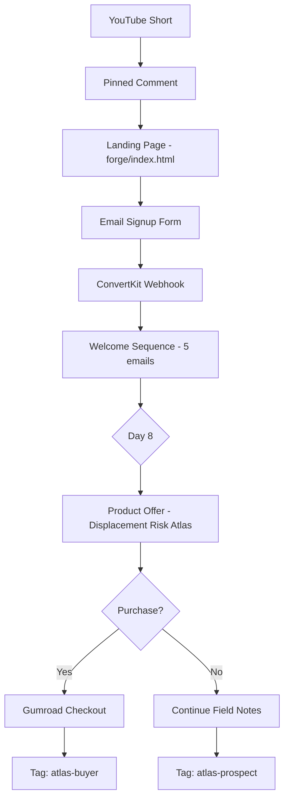

# Email Automation Wiring

**Purpose:** Email capture → nurture → product conversion for Displacement Risk Atlas  
**Platform:** ConvertKit or Beehiiv (free tier recommended)  
**Integration:** YouTube Shorts → Landing Page → Email → Product

---

## Architecture Overview



---

## Platform Selection

### Option A: ConvertKit (Recommended)

**Pros:**
- Free tier: Up to 1,000 subscribers
- Easy automation builder
- Tag-based segmentation
- Landing page builder included
- Webhook support for purchase tracking

**Cons:**
- Limited customization on free tier
- Branding on free plan

**Pricing:**
- Free: 0-1,000 subscribers
- Creator: $29/month (1,000-3,000 subscribers)

### Option B: Beehiiv

**Pros:**
- Free tier: Unlimited subscribers
- Better newsletter formatting
- Growth tools included
- No branding on free tier

**Cons:**
- Less robust automation
- Fewer integrations

**Pricing:**
- Free: Unlimited subscribers
- Scale: $42/month (advanced features)

---

## Setup Process

### Step 1: Create Account

1. Sign up for ConvertKit or Beehiiv
2. Verify email domain (optional but recommended)
3. Set up sender email: `field-notes@crisiscore.systems` (or similar)

### Step 2: Create Email Signup Form

**Form fields:**
- Email (required)
- First name (optional)
- Source tracking (hidden field: `utm_source`, `utm_content`)

**Form settings:**
- Double opt-in: Recommended (compliance)
- Success message: "Check your email for your first dispatch."
- Redirect: None (stay on landing page)
- Tag on signup: `displacement-atlas-sequence`

**Form embed code:**
```html
<!-- ConvertKit form embed -->
<script src="https://f.convertkit.com/xxxxxxxx/yyyyyyyyyy.js" 
        data-uid="yyyyyyyyyy" 
        data-format="inline" 
        data-version="5" 
        data-options='{"settings":{"after_subscribe":{"action":"message","success_message":"Check your email!","redirect_url":""},"analytics":{"google":null,"fathom":null,"facebook":null,"segment":null,"pinterest":null,"sparkloop":null,"googletagmanager":null},"modal":{"trigger":"timer","scroll_percentage":null,"timer":5,"devices":"all","show_once_every":15},"powered_by":{"show":false,"url":"https://convertkit.com"},"recaptcha":{"enabled":false},"return_visitor":{"action":"show","custom_content":""},"slide_in":{"display_in":"bottom_right","trigger":"timer","scroll_percentage":null,"timer":5,"devices":"all","show_once_every":15},"sticky_bar":{"display_in":"top","trigger":"immediate","scroll_percentage":null,"timer":null,"devices":"all","show_once_every":15}},"version":"5"}'>
</script>
```

### Step 3: Create Email Sequence

**Sequence name:** "Displacement Atlas Welcome"  
**Trigger:** Tag `displacement-atlas-sequence` applied  
**Duration:** 8 days  

**Email schedule:**

| Email | Day | Subject | Send Time |
|-------|-----|---------|-----------|
| 1 | 0 | CrisisCore Systems Field Notes — First Dispatch | Immediate |
| 2 | 2 | AI Displacement: The 50% Threshold | 10:00 AM |
| 3 | 4 | Legal Research + Radiology: Pattern Convergence | 10:00 AM |
| 4 | 6 | The Cascading Labor Flood Mechanism | 10:00 AM |
| 5 | 8 | Full Atlas: 10 Sectors Documented | 10:00 AM |

**Send time optimization:**
- Use subscriber timezone (if available)
- Default: 10:00 AM EST
- Avoid weekends for emails 2-4
- Email 5 (offer) can be weekend

### Step 4: Set Up Purchase Tracking

**Gumroad Webhook:**

1. Gumroad Settings → Advanced → Webhooks
2. Add webhook URL: `https://app.convertkit.com/purchase/xxxxxxxx`
3. Events: `sale.completed`, `sale.refunded`
4. Copy webhook secret

**ConvertKit Purchase Automation:**

1. Create automation: "Atlas Purchase"
2. Trigger: Purchase webhook from Gumroad
3. Actions:
   - Add tag: `atlas-buyer`
   - Remove tag: `displacement-atlas-sequence` (stop sequence)
   - Remove from automation: "Displacement Atlas Welcome"
   - Add to sequence: "Atlas Buyer Updates" (future product updates)

### Step 5: Set Up UTM Tracking

**YouTube pinned comment format:**
```
Pattern documentation: https://forge.crisiscore.systems?utm_source=youtube&utm_medium=shorts&utm_campaign=probe&utm_content=video_01

CrisisCore Systems analyzes displacement mechanisms, distributed credit systems, and attention infrastructure. Field notes delivered weekly.
```

**UTM structure:**
- `utm_source=youtube`
- `utm_medium=shorts`
- `utm_campaign=probe`
- `utm_content=video_[01-09]`

**Track in Google Analytics or Plausible:**
- Landing page visits by source
- Signup conversion rate by video
- Attribution: which videos drive signups/sales

---

## Email Content Guidelines

### Tone & Voice

- **Analytical, not sensational:** "The mechanism operates as..." not "This will destroy your career!"
- **Procedural, not prescriptive:** "Observable patterns include..." not "You should do..."
- **No urgency tactics:** No "limited time," "only X left," "act now"
- **No guaranteed outcomes:** No "this will protect you," "guaranteed safety"

### Formatting

- **Subject lines:** Clear, descriptive, no clickbait
- **Preview text:** Extends subject line, adds context
- **Body:** Short paragraphs (2-3 sentences max)
- **Spacing:** Use `---` for section breaks
- **CTAs:** Max 1 per email (except Email 5 can have 2: personal + commercial)
- **Unsubscribe:** Always visible, no tricks

### Compliance

✅ **CAN-SPAM compliant:**
- Physical address in footer
- Unsubscribe link in every email
- Honor unsubscribe requests within 10 days
- No deceptive subject lines

✅ **GDPR compliant (if EU subscribers):**
- Double opt-in
- Clear data usage policy
- Right to deletion

---

## Metrics & Tracking

### Email Funnel Metrics

Create new tab in NODE_NULL_TRACKER: **Email Funnel**

| Field | Description | Source |
|-------|-------------|--------|
| `video_id` | Video number (01-09) | Manual |
| `publish_date` | Video publish date | Manual |
| `views_48h` | Total views at 48h | YouTube Studio |
| `landing_page_visits` | UTM-tracked visits | Google Analytics |
| `email_signups` | Total signups from this video | ConvertKit |
| `signup_rate` | (Signups / Views) × 100 | Calculated |
| `email_1_opens` | Opens on Welcome email | ConvertKit |
| `email_5_opens` | Opens on Offer email | ConvertKit |
| `product_conversions` | Purchases from cohort | Gumroad + attribution |
| `conversion_rate` | (Conversions / Signups) × 100 | Calculated |
| `revenue` | Total revenue from cohort | Gumroad |

### Success Metrics (Phase 1: First 90 days)

| Metric | Target | Status |
|--------|--------|--------|
| Total email signups | 100+ | TBD |
| Average email open rate | >30% | TBD |
| Email 5 click rate | >5% | TBD |
| Conversion rate (signups → sales) | >1% | TBD |
| Total revenue | $200-400 | TBD |

### Weekly Review

Every Monday:
1. Check email sequence performance (opens, clicks)
2. Review Gumroad sales data
3. Update NODE_NULL_TRACKER Email Funnel tab
4. Identify underperforming emails → iterate subject lines
5. Check for spam complaints or high unsubscribe rate

---

## Automation Flow (Technical)

### Landing Page Form Submit

```javascript
// forge/index.html form handler
document.getElementById('email-signup').addEventListener('submit', async (e) => {
  e.preventDefault();
  
  const email = e.target.email.value;
  const utmSource = new URLSearchParams(window.location.search).get('utm_source') || 'direct';
  const utmContent = new URLSearchParams(window.location.search).get('utm_content') || 'unknown';
  
  // Submit to ConvertKit
  const response = await fetch('https://api.convertkit.com/v3/forms/FORM_ID/subscribe', {
    method: 'POST',
    headers: { 'Content-Type': 'application/json' },
    body: JSON.stringify({
      api_key: 'YOUR_API_KEY',
      email: email,
      tags: ['displacement-atlas-sequence'],
      fields: {
        utm_source: utmSource,
        utm_content: utmContent
      }
    })
  });
  
  if (response.ok) {
    alert('Check your email for your first dispatch!');
  } else {
    alert('Something went wrong. Please try again.');
  }
});
```

### Gumroad → ConvertKit Webhook

**Gumroad sends:**
```json
{
  "sale_id": "xxxxxxxx",
  "product_name": "Displacement Risk Atlas",
  "email": "customer@example.com",
  "price": "1900",
  "currency": "usd",
  "license_key": "XXXX-XXXX-XXXX-XXXX",
  "timestamp": "2026-02-10T14:30:00Z"
}
```

**ConvertKit receives and:**
1. Finds subscriber by email
2. Adds tag: `atlas-buyer`
3. Removes tag: `displacement-atlas-sequence`
4. Stops "Displacement Atlas Welcome" automation
5. Adds to "Atlas Buyer Updates" sequence (future)

---

## Troubleshooting

### Low Signup Rate (<1% of views)

**Possible causes:**
- Pinned comment not prominent enough
- Landing page unclear/confusing
- Value proposition weak
- Too many form fields

**Solutions:**
- Test different pinned comment copy
- Simplify landing page
- A/B test headlines
- Remove optional form fields

### Low Email Open Rates (<25%)

**Possible causes:**
- Subject lines not compelling
- Sender email looks spammy
- Wrong send time

**Solutions:**
- Test different subject lines
- Verify sender domain
- Adjust send times

### Low Conversion Rate (<0.5%)

**Possible causes:**
- Product positioning unclear
- Price too high
- Trust not established
- Email sequence too short/long

**Solutions:**
- Clarify product value in Email 5
- Test lower price point
- Add testimonials (if available)
- Adjust sequence timing

---

## Compliance & Risk Management

### Email Platform Risk

**Risk:** Account suspension for spam complaints

**Mitigation:**
- Double opt-in (recommended)
- Clear unsubscribe link
- Honor unsubscribes immediately
- No purchased email lists

### Data Privacy

**Risk:** GDPR/CCPA violations

**Mitigation:**
- Privacy policy on landing page
- Clear data usage statement
- Right to deletion honored
- Data retention policy

### Product Liability

**Risk:** Customers claim misleading advice

**Mitigation:**
- Clear disclaimers in every email
- "Not career advice" repeated
- "No guaranteed outcomes" emphasized
- Refund policy honored (30 days)

---

## Scaling Strategy

### Phase 1 (Weeks 1-4): Manual

- Manual email sending (if needed)
- Manual metrics tracking
- Manual Gumroad order fulfillment

### Phase 2 (Weeks 5-8): Automated

- Full automation via ConvertKit
- Gumroad webhook integration
- Automated metrics pull

### Phase 3 (Month 3+): Optimization

- A/B test subject lines
- Test email timing
- Add testimonials
- Create product variations

---

## Next Steps

1. Create ConvertKit account
2. Set up email signup form
3. Create 5-email sequence
4. Set up Gumroad webhook
5. Test full funnel (signup → email → purchase)
6. Launch with Week 1 YouTube videos

---

## Links

- **Email Sequence Copy:** [../forge/email_sequences/displacement_atlas_welcome.md](../forge/email_sequences/displacement_atlas_welcome.md)
- **Landing Page:** [../forge/index.html](../forge/index.html)
- **Product Details:** [../products/displacement_risk_atlas/README.md](../products/displacement_risk_atlas/README.md)
- **Automation Wiring:** [wiring.md](wiring.md)
