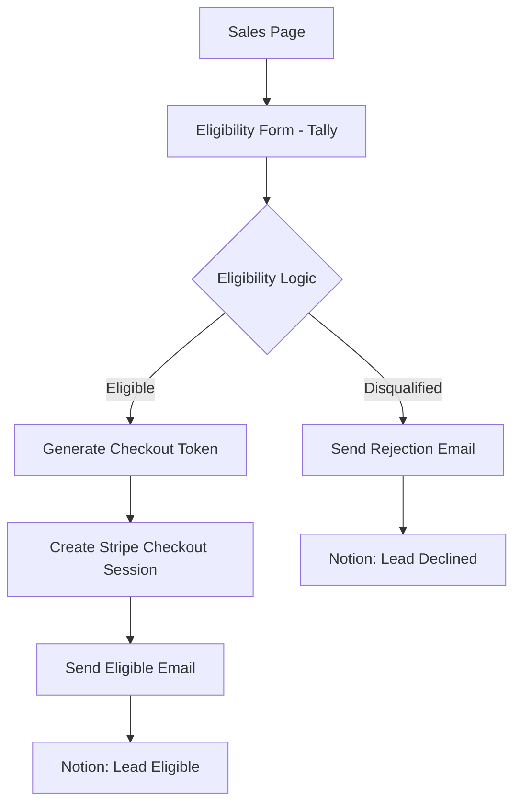
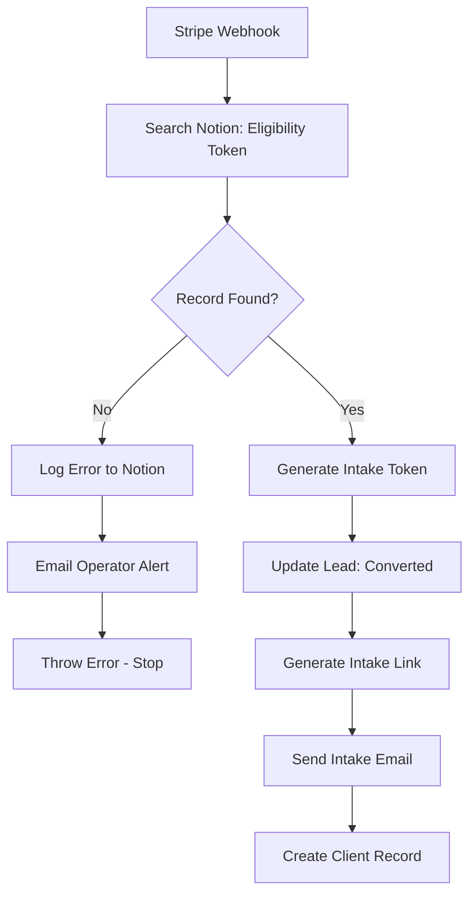
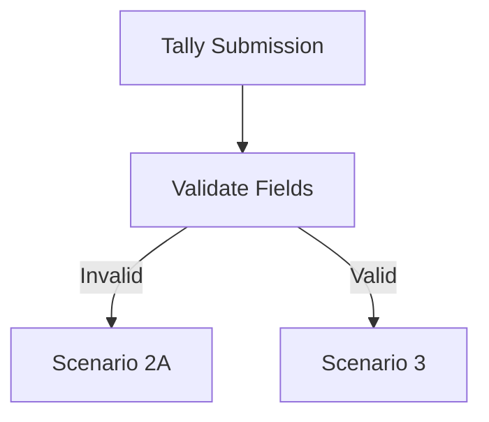
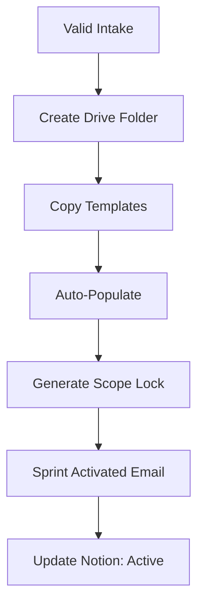
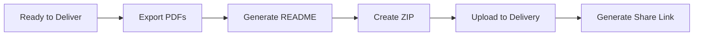
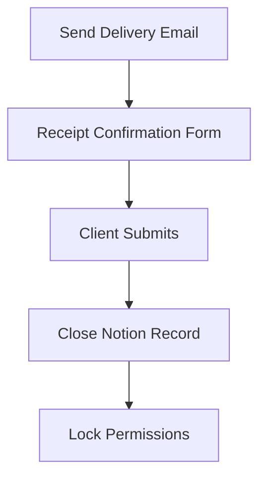
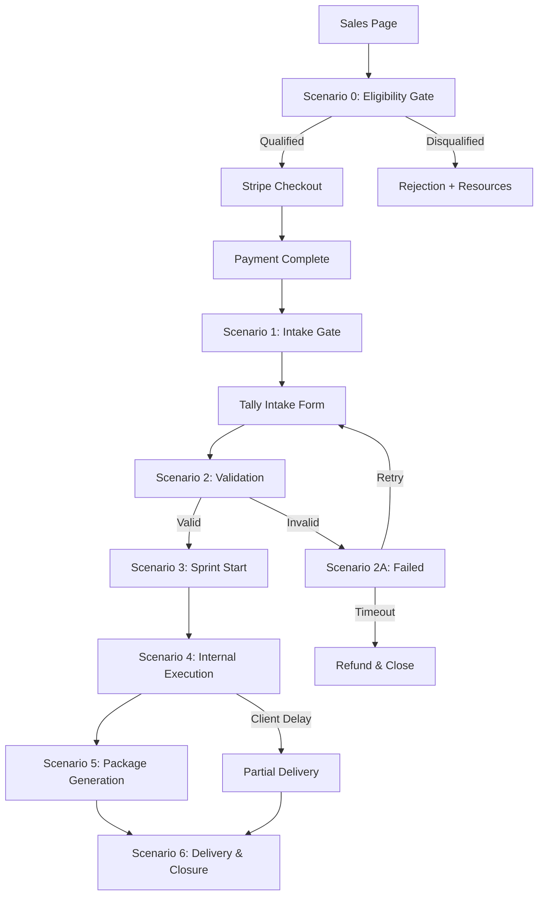

# Service Automation Wiring

Service delivery automation for fixed-scope engagements.

Extends the core automation wiring: [wiring.md](wiring.md)

Hard boundaries:

- Governance: [docs/01_rules.md](../docs/01_rules.md)
- Workflow: [docs/02_workflow.md](../docs/02_workflow.md)
- Monetization: [monetization/architecture.md](../monetization/architecture.md)
- Product engine: [monetization/product_engine.md](../monetization/product_engine.md)

---

## 0) Service Automation Principles

- **Async-first:** No synchronous communication required
- **System-enforced:** Rules enforced by automation, not humans
- **Auditable:** Every action logged with timestamps
- **Fixed-scope:** No scope creep, no exceptions
- **Conditional refunds:** Pre-start only, system-enforced

The automation is the bouncer.

---

## 1) Stack (Locked)

| Component | Tool | Purpose |
| --- | --- | --- |
| Payments | Stripe | Checkout, refunds, webhooks |
| Automation | Make (Integromat) | Workflow orchestration |
| Forms | Tally.so | Intake, receipt confirmation |
| Docs | Google Docs | Artifact creation |
| Storage | Google Drive | Workspace, delivery |
| Tracking | Notion | Status, tasks |
| Email | Gmail (via Make) | Client communication |

Optional upgrade: n8n (self-hosted) for sovereignty.

---

## 2) Global Engagement Rules

These rules are enforced by the automation system:

| Rule | Enforcement Point |
| --- | --- |
| Pre-purchase qualification | Eligibility gate before checkout |
| Async-only | No call scheduling unless add-on purchased |
| Fixed scope | Scope locked at workspace creation |
| Written deliverables only | All outputs are documents |
| Conditional refunds only | Refund API blocked after sprint start |
| No scope creep | No mechanism to add scope mid-sprint |
| No "quick calls" | Call requires separate purchase |
| Time-box enforcement | Client delays do not extend timeline |

---

## 2.1) Time-Box Enforcement

**Rule:** Client delays do not extend sprint timelines unless explicitly agreed in writing.

### Enforcement Logic

| Trigger | Action | Outcome |
| --- | --- | --- |
| Intake accepted, access not granted within 5 days | Warning email | 72h to provide access |
| Access still not granted after warning | Second warning | 48h final notice |
| Day 14 reached without access | Auto-close sprint | Partial findings + scope note |

### Partial Delivery Protocol

If sprint closes due to client delay:

1. Deliver whatever findings are possible with available information
2. Document scope limitations in executive summary
3. Add "INCOMPLETE - CLIENT DELAY" watermark to deliverables
4. No refund (sprint started, work performed)

### Email: Access Not Granted Warning

**Subject:** Collapse-Ready Sprint — Access Required (Urgent)

**Body:**

```
Your sprint started {{days_since_start}} days ago, but we have not received the 
access or documentation needed to proceed.

ACTION REQUIRED

Please provide the following within 72 hours:
{{missing_access_items}}

If access is not provided, the sprint will proceed with limited scope 
and deliver partial findings on the scheduled delivery date.

Client delays do not extend sprint timelines.

---
Collapse-Ready Sprint
```

---

## 3) Conditional Refund Policy

### Refunds Allowed If:

- Intake rejected due to missing/incompatible inputs
- Client cannot provide required access
- Scope mismatch discovered before sprint start

### Refunds NOT Allowed If:

- Sprint has started (workspace created)
- Client fails to complete intake
- Client unresponsive after sprint start

### Sprint Start Definition:

Sprint starts when workspace + documents are created. This is the refund lock point.

---

## 4) End-to-End Automation Scenarios

### Scenario 0 — Pre-Purchase Eligibility Gate (Make: Eligibility_Gate)

**Purpose:** Filter unqualified prospects before payment moves. Block bad fits, reduce refunds, eliminate credential objections upfront.

**Trigger:** `Tally → Eligibility Form Submitted`

**Eligibility Logic (Router):**

Eligible IF ALL TRUE:
- Access ≠ "No"
- Communication = Async-only + Written deliverables only
- Scope acknowledged (both checkboxes)
- Evaluation standard acknowledged (both checkboxes)
- Credentials requirement = "No"
- Final acknowledgement checked

**Path A — Eligible:**

1. **Make: Generate unique Checkout Token**
2. **Stripe: Create Checkout Session**
   - Product: Collapse-Ready Systems Hardening™
   - Add optional "Single Call" upsell
3. **Gmail: Send "Eligible — Proceed to Checkout"**
   - Includes Stripe link
   - Reiterates constraints
4. **Notion: Create Lead Record**
   - Status = `Eligible / Awaiting Payment`

**Path B — Rejected:**

1. **Gmail: Send "Not a Fit — Engagement Declined"**
   - No apology, no debate hook
2. **Notion: Create Lead Record**
   - Status = `Declined (Eligibility)`
   - Reason = [specific disqualification code]
3. **END**



**What This Achieves:**

- Bad fits filtered before payment
- Credential objections eliminated upfront
- Disagreement can't spiral (scope boundary set early)
- Refund pressure drops
- Authority is procedural, not personal

See [../products/collapse_ready_sprint/templates/eligibility_gate_spec.md](../products/collapse_ready_sprint/templates/eligibility_gate_spec.md) for full form specification.

---

### Scenario 1 — Payment → Intake Gate (CRS_01_Payment_Intake)

**Trigger:** `Stripe → checkout.session.completed`

**⚠️ ENFORCEMENT REQUIRED:** This scenario must validate eligibility before proceeding.

**Steps:**

1. **Stripe: Retrieve session (webhook trigger)**
   - Module: Stripe → Watch Events (checkout.session.completed)
   - **Key fields from webhook payload:**
     - `{{1.id}}` - Stripe Checkout Session ID
     - `{{1.customer_details.email}}` - Client email
     - `{{1.payment_intent}}` - Payment Intent ID (use as payment reference)
     - `{{1.metadata.eligibility_token}}` - Token from Scenario 0
     - `{{1.metadata.source}}` - Should be "eligibility_gate"
     - `{{1.line_items}}` - Products purchased (check for call add-on)

2. **Notion: Search for eligibility record (NEW - CRITICAL)**
   - App: Notion
   - Action: Search objects (database query)
   - Database: CRS Leads
   - Filter: `Eligibility Token = {{1.metadata.eligibility_token}} AND Status = "Eligible / Awaiting Payment"`

3. **Router: Validate search result**
   - Route A (Valid): Search returned exactly 1 result → Continue to step 4
   - Route B (Invalid): Search returned 0 results → Go to abort path

**ABORT PATH (Route B):**

3B-1. **Notion: Log error record**
   - Database: CRS Errors (create if needed)
   - Fields:
     - Type: `ELIGIBILITY_BYPASS_ATTEMPT`
     - Email: `{{1.customer_details.email}}`
     - Stripe Session ID: `{{1.id}}`
     - Payment Intent: `{{1.payment_intent}}`
     - Eligibility Token: `{{eligibility_token}}` (may be empty)
     - Timestamp: `{{now()}}`
     - Details: `Payment received without valid eligibility record`

3B-2. **Gmail: Alert operator**
   - To: `operator@yourdomain.com`
   - Subject: `⚠️ CRS Alert: Eligibility Bypass Attempt`
   - Body:
     ```
     A payment was received but no matching eligibility record exists.
     
     Email: {{1.customer_details.email}}
     Stripe Session ID: {{1.id}}
     Payment Intent: {{1.payment_intent}}
     Eligibility Token: {{1.metadata.eligibility_token}}
     
     Action required: Review payment and either:
     1. Refund via Stripe Dashboard
     2. Manually create eligibility record if legitimate
     ```

3B-3. **Make: Stop scenario with error**
   - Module: **Tools → Set variable** (for logging) then **Error handler**
   - In Make, add an Error Handler to the Notion search module
   - Configure: "Resume" = No (scenario stops)
   - Or use: **Router with fallback** → **Break** module
   - The Break module stops execution and optionally rolls back previous steps

**CONTINUE PATH (Route A):**

4. **Make: Generate intake token**
   - Module: Tools → Generate UUID
   - Store in variable: `intake_token`

5. **Notion: Update lead record**
   - Find record from step 2 (use `{{2.id}}` from search result)
   - Update fields:
     - Status: `Converted`
     - Converted At: `{{now()}}`
     - Stripe Session ID: `{{1.id}}`
     - Payment Intent: `{{1.payment_intent}}`
     - Intake Token: `{{intake_token}}`

6. **Tally: Generate unique intake link**
   - Base URL: `https://tally.so/r/[intake-form-id]`
   - Prefill parameters:
     - `email={{1.customer_details.email}}`
     - `intake_token={{intake_token}}`
     - `eligibility_token={{1.metadata.eligibility_token}}`
     - `stripe_session={{1.id}}`

7. **Gmail: Send "Sprint Intake Required" email**
   - To: `{{1.customer_details.email}}`
   - Subject: `Collapse-Ready Sprint — Intake Required (48h)`
   - Body: intake link, deadline, refund policy, constraint reminder

8. **Notion: Create client record**
   - Database: CRS Clients
   - Fields:
     - Client Name: `{{1.customer_details.name}}`
     - Email: `{{1.customer_details.email}}`
     - Stripe Session ID: `{{1.id}}`
     - Payment Intent: `{{1.payment_intent}}`
     - Eligibility Token: `{{1.metadata.eligibility_token}}`
     - Intake Token: `{{intake_token}}`
     - Intake Status: `Pending`
     - Sprint Status: `Not Started`
     - Call Add-On: (check if line_items includes call product)



**What This Prevents:**

- Manual Stripe links (bypassing eligibility)
- Shared checkout URLs from ineligible prospects
- "But I already paid" edge cases
- Bad-faith actors who find checkout links

---

### Scenario 2 — Intake Submission → Validation

**Trigger:** `Tally → Form Submitted`

**Steps:**

1. **Make: Validate required fields**
   - Repo/system access present?
   - Third-party services listed?
   - Success criteria defined?
   - Constraints acknowledged (checkbox)?

2. **Router**
   - If ❌ invalid → Scenario 2A
   - If ✅ valid → Scenario 3



---

### Scenario 2A — Intake Failed

**Steps:**

1. **Gmail: Send "Intake Incomplete" email**
   - List missing items
   - 72h deadline

2. **Notion: Update intake status**
   - Status: `Incomplete`

3. **If deadline expires (optional):**
   - Stripe: Partial refund
   - Close record
   - End automation

---

### Scenario 3 — Workspace Creation (Sprint Start)

**⚠️ This moment locks refunds**

**Steps:**

1. **Google Drive: Create client folder**
   ```
   /Collapse-Ready-Sprints/
     /Client-<Token>/
       /01-Threat-Model/
       /02-Data-Flows/
       /03-Findings/
       /04-Hardening/
       /05-Executive-Summary/
       /06-Scope-Lock/
       /07-Client-Provided/
       /08-Delivery/
   ```

2. **Google Docs: Copy templates**
   - Threat Model
   - Data Flow Map
   - Findings Register
   - Pass/Fail Gates
   - Executive Summary
   - Scope Lock

3. **Google Docs: Auto-populate**
   - Client name
   - Scope summary
   - Assumptions
   - Dates

4. **Google Docs: Generate scope lock**
   - In scope
   - Out of scope
   - Constraints
   - Success criteria

5. **Gmail: Send "Sprint Activated" email**
   - Confirms sprint start
   - Restates no-refund point
   - Shares delivery date

6. **Notion: Update status**
   - Intake: `Accepted`
   - Sprint: `Active`



---

### Scenario 4 — Internal Execution Support

**No client touch. Internal only.**

**Steps (optional, recommended):**

1. **Notion: Auto-create tasks**
   - Threat model
   - Flow enumeration
   - Findings
   - Hardening
   - Summary

2. **Make: Deadline reminder**
   - Ping at day 10 if not marked complete

No client notifications in this scenario.

---

### Scenario 5 — Delivery Package Generation

**Trigger:** Manual toggle in Notion: `Sprint = Ready to Deliver`

**Steps:**

1. **Google Docs → Export PDFs**
   - All artifacts

2. **Make: Generate README.md**
   - Artifact list
   - Scope reminder
   - Residual risks
   - Hash notice (optional)

3. **Make: ZIP package**
   - PDFs + README

4. **Google Drive: Upload to /Delivery/**
   - Generate view-only link



---

### Scenario 6 — Delivery & Closure

**Steps:**

1. **Gmail: Send delivery email**
   - Subject: `Collapse-Ready Sprint — Delivery Package`
   - Includes: secure link, executive summary excerpt
   - Optional: call upsell (if not purchased)

2. **Tally: Send receipt confirmation form**
   - One checkbox: "I confirm receipt of the delivery package."

3. **On submission:**
   - Notion: Sprint = `Closed`
   - Archive folder permissions locked
   - Timestamp logged



---

## 5) Artifact Integrity (Optional Enhancement)

Generate SHA256 hashes of delivery PDFs and include in README.

**Implementation:**

1. After PDF export, calculate SHA256 hash
2. Store hashes in Make variable
3. Include in README.md generation

**Value:**

- Demonstrates seriousness
- Enables integrity verification
- Professional-grade delivery

---

## 6) Data Flow (End-to-End)



---

## 7) Notion Database Schema

### Client Records Table

| Field | Type | Values |
| --- | --- | --- |
| Client Name | Text | |
| Email | Email | |
| Intake Token | Text (UUID) | |
| Stripe Payment ID | Text | |
| Intake Status | Select | Pending, Incomplete, Accepted, Rejected |
| Sprint Status | Select | Not Started, Active, Ready to Deliver, Closed |
| Sprint Start Date | Date | |
| Delivery Date | Date | |
| Call Add-On | Checkbox | |
| System Name | Text | |
| Drive Folder URL | URL | |
| Delivery Link | URL | |
| Notes | Long Text | |

### Tasks Table (Optional)

| Field | Type | Values |
| --- | --- | --- |
| Task Name | Text | |
| Client | Relation | Client Records |
| Status | Select | To Do, In Progress, Done |
| Due Date | Date | |

---

## 8) Error Handling

### Stripe Webhook Failures

- Retry webhook delivery (Stripe handles)
- Log failed webhooks
- Alert on repeated failures

### Intake Validation Failures

- Send incomplete email
- Set deadline timer
- Auto-close on timeout

### Google API Failures

- Retry with exponential backoff
- Alert on repeated failures
- Do not proceed without workspace confirmation

### Email Delivery Failures

- Retry once
- Log failure
- Manual intervention required

---

## 9) Security Considerations

- No credentials in automation logs
- Stripe webhooks verified via signature
- Google OAuth tokens refreshed automatically
- Notion API key scoped to databases
- Email sent via authenticated Gmail
- All links use HTTPS

---

## 10) Monitoring and Alerts

| Event | Alert Method |
| --- | --- |
| Payment received | Notion record created |
| Intake deadline approaching | Email to operator |
| Intake expired | Notification + auto-action |
| Sprint deadline approaching | Email to operator |
| Delivery ready | Notification |
| Receipt not confirmed (48h) | Reminder sent |

---

## 11) What You Do Not Have to Do

The system handles:

- Chasing clients
- Scheduling calls
- Re-explaining scope
- Justifying credentials
- Managing files manually
- Arguing about refunds
- Defending boundaries verbally

The automation is the bouncer.

---

## 12) Future Upgrades

| Upgrade | When | Benefit |
| --- | --- | --- |
| Markdown + Git | High volume | Version control |
| Self-host n8n | Revenue justifies | Sovereignty |
| Case study request | Post-close | Marketing |
| Pre-audit upsell | Established flow | Revenue |
