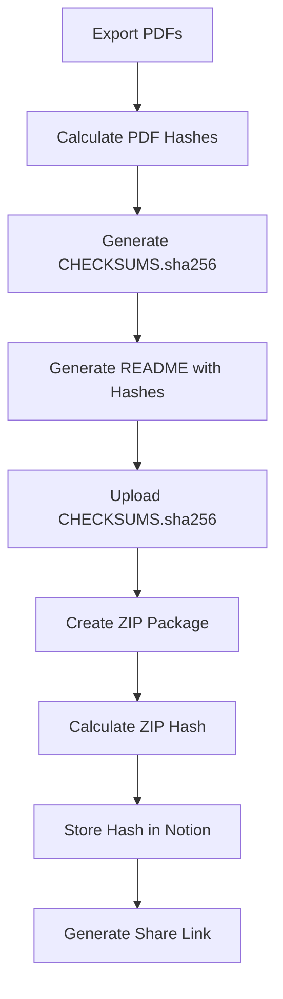

# Artifact Integrity Specification

Document: Collapse-Ready Sprint — Artifact Integrity Hashing

Version: v01

---

## Purpose

Generate SHA256 hashes of all delivery artifacts to:

- Prove delivery package hasn't been modified after delivery
- Provide tamper-evident packaging
- Enable client verification of received files
- Support legal defensibility if artifacts are challenged

---

## Hash Generation Process

### When to Generate

Hashes are generated in **Scenario 5 — Delivery Package Generation**, after PDF export and before ZIP creation.

### What to Hash

| Artifact | Filename Pattern | Hash Required |
| --- | --- | --- |
| Threat Model | `threat_model.pdf` | ✅ |
| Data Flow Map | `data_flow_map.pdf` | ✅ |
| Findings Register | `findings_register.pdf` | ✅ |
| Pass/Fail Gates | `pass_fail_gates.pdf` | ✅ |
| Executive Summary | `executive_summary.pdf` | ✅ |
| Scope Lock | `scope_lock.pdf` | ✅ |
| README | `README.md` | ❌ (contains hashes) |
| ZIP Package | `delivery_package.zip` | ✅ (hash of final package) |

---

## Hash Algorithm

**Algorithm:** SHA-256

**Format:** Lowercase hexadecimal

**Example:**

```
e3b0c44298fc1c149afbf4c8996fb92427ae41e4649b934ca495991b7852b855
```

---

## Manifest File Format

Create `CHECKSUMS.sha256` in the delivery folder:

```
# Collapse-Ready Sprint — Delivery Package Checksums
# Generated: 2026-02-02T03:57:20Z
# Client: {{client_name}}
# Engagement Token: {{engagement_token}}

a1b2c3d4e5f6... threat_model.pdf
b2c3d4e5f6a1... data_flow_map.pdf
c3d4e5f6a1b2... findings_register.pdf
d4e5f6a1b2c3... pass_fail_gates.pdf
e5f6a1b2c3d4... executive_summary.pdf
f6a1b2c3d4e5... scope_lock.pdf
```

---

## README.md Integration

Add hashes section to delivery README:

```markdown
## Artifact Integrity Verification

All artifacts in this package have been hashed using SHA-256.

To verify integrity:

1. Download CHECKSUMS.sha256
2. Run: `sha256sum -c CHECKSUMS.sha256`
3. All files should show "OK"

If any file shows "FAILED", the artifact has been modified since delivery.

### Checksums

| File | SHA-256 |
| --- | --- |
| threat_model.pdf | `{{hash_threat_model}}` |
| data_flow_map.pdf | `{{hash_data_flow_map}}` |
| findings_register.pdf | `{{hash_findings_register}}` |
| pass_fail_gates.pdf | `{{hash_pass_fail_gates}}` |
| executive_summary.pdf | `{{hash_executive_summary}}` |
| scope_lock.pdf | `{{hash_scope_lock}}` |

### Package Hash

The final delivery ZIP package hash:
`{{hash_delivery_zip}}`
```

---

## Make Automation Integration

### Scenario 5 — Updated Steps

**Module 1:** Google Docs → Export PDFs (existing)

**Module 2 (NEW):** Calculate SHA256 hashes

| Setting | Value |
| --- | --- |
| App | Make → Tools → Text parser or HTTP module |
| Method | SHA256 of each file |

**Option A — Using Make's HTTP Module:**

For each PDF:

```
HTTP → Make a request
Method: POST
URL: https://api.hashify.net/hash/sha256/hex
Body: (file content as base64)
```

**Option B — Using Google Apps Script:**

Create a Google Apps Script to calculate hashes:

```javascript
function calculateSHA256(fileId) {
  var file = DriveApp.getFileById(fileId);
  var blob = file.getBlob();
  var hash = Utilities.computeDigest(
    Utilities.DigestAlgorithm.SHA_256,
    blob.getBytes()
  );
  return hash.map(function(b) {
    return ('0' + (b & 0xFF).toString(16)).slice(-2);
  }).join('');
}
```

Call via Make's Google Apps Script module.

**Module 3:** Generate CHECKSUMS.sha256

| Setting | Value |
| --- | --- |
| App | Make → Tools → Set variable |
| Content | Concatenate hashes with filenames |

**Module 4:** Generate README.md with hashes (existing, modified)

**Module 5:** Create CHECKSUMS.sha256 file

| Setting | Value |
| --- | --- |
| App | Google Drive |
| Action | Create a text file |
| Filename | `CHECKSUMS.sha256` |
| Content | `{{checksums_content}}` |

**Module 6:** Create ZIP package (existing)

**Module 7 (NEW):** Calculate final ZIP hash

**Module 8:** Update Notion with package hash

| Setting | Value |
| --- | --- |
| App | Notion |
| Action | Update database item |
| Field | Delivery Package Hash |
| Value | `{{hash_delivery_zip}}` |

---

## Flowchart



---

## Verification Instructions for Client

Include in delivery email:

```
ARTIFACT INTEGRITY VERIFICATION

All artifacts have been SHA-256 hashed for integrity verification.

To verify:

1. Download CHECKSUMS.sha256 from the delivery folder
2. Open terminal/command prompt in the download folder
3. Run: sha256sum -c CHECKSUMS.sha256 (Linux/Mac)
   Or: certutil -hashfile <filename> SHA256 (Windows)
4. All files should show "OK" or matching hash

If verification fails, contact us immediately — the files may have been 
tampered with in transit.
```

---

## Notion Schema Addition

Add to CRS Clients database:

| Field | Type |
| --- | --- |
| Delivery Package Hash | Text |
| Hash Generated At | Date |
| Verification URL | URL (optional: link to hash verification service) |

---

## Legal Defensibility

Hashing provides:

1. **Proof of delivery state:** "This is what we delivered"
2. **Tamper detection:** Client can verify files weren't modified
3. **Timestamp proof:** Combined with delivery timestamp
4. **Non-repudiation:** Neither party can claim different content was delivered

---

## Edge Cases

### Client Claims Different Content

1. Request they provide the files they received
2. Calculate hash of their files
3. Compare to stored hash in Notion
4. If mismatch → files were modified after delivery

### File Corruption in Transit

1. Client downloads, verification fails
2. Request re-download from original link
3. If still fails → regenerate delivery package

### Client Cannot Verify

1. Provide step-by-step instructions
2. Offer to verify on a call (if call add-on purchased)
3. Provide hash verification via web tool (optional)

---

## Why This Matters

- **Professionalism:** Rare in the industry, signals seriousness
- **Legal protection:** Tamper-evident delivery
- **Trust building:** Client can verify what they received
- **Dispute resolution:** Clear evidence if content is challenged
- **Compliance support:** Audit trail for regulated industries
