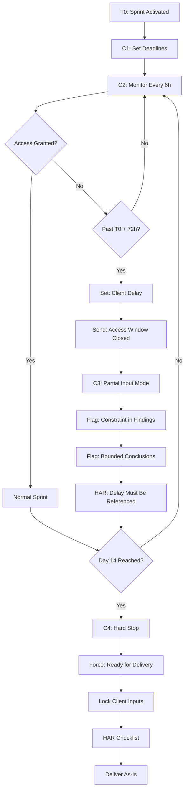

# Time-Boxed Client Delay Kill Switch (TDKS)

Document: Collapse-Ready Sprint — Time-Boxed Delay Kill Switch

Version: v02

---

## Purpose

Prevent clients from:

- Stalling access
- Drip-feeding materials
- Rewriting scope by delay
- Forcing "extensions" through inaction

**Rule:** The sprint clock is real. Client delay does **not** pause it.

---

## Policy (Verbatim)

> **Client Delay Policy**
>
> The sprint timeline begins upon workspace creation.
>
> Client delays (including delayed access, incomplete materials, or partial responses) do not extend the sprint unless explicitly agreed in writing.
>
> If required access is not provided within the defined access window, the sprint will proceed with available materials and may close with partial findings.
>
> No refunds are issued once the sprint has started.

This turns time into a **hard boundary**.

---

## Access Windows (Constants)

Define these constants once:

| Constant | Definition | Value |
| --- | --- | --- |
| **T0** | Sprint Activated (workspace created) | Timestamp |
| **Access Window** | Time to provide access | 72 hours from T0 |
| **Sprint Duration** | Total engagement time | 14 calendar days from T0 |
| **Closure** | Sprint ends | Day 14, regardless of client behavior |

---

## Notion Schema — TDKS Fields

Add to CRS Clients database:

| Field | Type | Description |
| --- | --- | --- |
| Sprint Start (T0) | DateTime | Workspace creation timestamp |
| Access Granted | Checkbox | Has client provided access? |
| Access Deadline | DateTime | T0 + 72 hours |
| Delay Status | Select | None, Client Delay, Proceeding With Partial Inputs |
| Sprint End | DateTime | T0 + 14 days |

---

## Make Scenarios (C1-C4)

### SCENARIO C1 — Set Deadlines at Sprint Start

**Trigger:** Scenario 3 — Workspace Creation (Sprint Activated)

**Add to Scenario 3 workflow:**

| Step | Action | Value |
| --- | --- | --- |
| 1 | Set `Sprint Start (T0)` | `{{now()}}` |
| 2 | Set `Access Deadline` | `{{addHours(now; 72)}}` |
| 3 | Set `Sprint End` | `{{addDays(now; 14)}}` |
| 4 | Set `Delay Status` | `None` |

**Make Module Configuration:**

| Setting | Value |
| --- | --- |
| App | Notion |
| Action | Update database item |

```
Fields to update:
- Sprint Start (T0): {{now()}}
- Access Deadline: {{addHours(now; 72)}}
- Sprint End: {{addDays(now; 14)}}
- Delay Status: None
```

---

### SCENARIO C2 — Access Deadline Monitor

**Scenario Name:** `CRS_C2_Access_Deadline_Monitor`

**Trigger:** Scheduled (every 6 hours)

#### MODULE 1 — Trigger: Schedule

| Setting | Value |
| --- | --- |
| App | Make → Schedule |
| Interval | Every 6 hours |

#### MODULE 2 — Search for Overdue Sprints

| Setting | Value |
| --- | --- |
| App | Notion |
| Action | Search objects |
| Database | CRS Clients |

**Filter:**

```
Access Granted = false
AND now() > Access Deadline
AND Delay Status = "None"
```

#### MODULE 3 — Iterator

Process each overdue sprint.

#### MODULE 4 — Update Delay Status

| Setting | Value |
| --- | --- |
| App | Notion |
| Action | Update database item |
| Field | Delay Status |
| Value | `Client Delay` |

#### MODULE 5 — Send Client Notice (One-Time)

| Setting | Value |
| --- | --- |
| App | Gmail |
| Action | Send email |

**Subject:**

```
Access Window Closed — Sprint Proceeding
```

**Body (paste verbatim):**

```
The access window has closed.

The sprint will proceed using available materials.

Findings may be partial and will reflect documented access limitations.

The sprint end date remains unchanged.
```

No questions. No options.

#### MODULE 6 — Log Event

| Setting | Value |
| --- | --- |
| App | Notion |
| Action | Update database item |

**Fields:**

| Field | Value |
| --- | --- |
| Access Window Closed | `{{now()}}` |
| Delay Notice Sent | true |

---

### SCENARIO C3 — Partial Input Mode (Automatic)

**Trigger:** `Delay Status = "Client Delay"`

**Effects (System-Level):**

When Delay Status = "Client Delay", the following auto-flags are applied:

#### 1. Findings Register Auto-Flag

Add to each finding:

```
Constraint: Client access delay
```

#### 2. Executive Summary Auto-Include

Add section:

```
## Access Limitation Notice

Certain conclusions are bounded by unavailable inputs.

The sprint proceeded with available materials after the access window closed.
```

#### 3. HAR Checklist Requirement

Pre-delivery checklist REQUIRES:

- [ ] Client delay explicitly referenced in all artifacts
- [ ] Scope limitations documented
- [ ] "Bounded by unavailable inputs" statement present

This prevents blame reversal later.

---

### SCENARIO C4 — Hard Stop at Day 14

**Scenario Name:** `CRS_C4_Hard_Stop`

**Trigger:** Scheduled (daily at 00:00 UTC)

#### MODULE 1 — Trigger: Daily Schedule

| Setting | Value |
| --- | --- |
| App | Make → Schedule |
| Interval | Daily at 00:00 UTC |

#### MODULE 2 — Search for Expired Sprints

| Setting | Value |
| --- | --- |
| App | Notion |
| Action | Search objects |
| Database | CRS Clients |

**Filter:**

```
now() >= Sprint End
AND Sprint Status ≠ "Closed"
```

#### MODULE 3 — Iterator

Process each expired sprint.

#### MODULE 4 — Force Ready for Delivery

| Setting | Value |
| --- | --- |
| App | Notion |
| Action | Update database item |

**Fields:**

| Field | Value |
| --- | --- |
| Sprint Status | `Ready for Delivery` |
| Hard Stop Enforced | true |
| Hard Stop Date | `{{now()}}` |

#### MODULE 5 — Lock Further Client Inputs

**Action:** Revoke client edit access to workspace folder (if applicable)

#### MODULE 6 — Trigger Delivery Pipeline

Proceed to:

1. HAR checklist → verify complete
2. Delivery package generation
3. Deliver **as-is**

**No extensions by default.**

Any exception must be **manual and explicit** (operator chooses).

---

## Delivery Package — Access Limitations

If delay occurred, auto-append to delivery README.md:

```markdown
## Access Limitations

Certain findings are bounded by unavailable inputs due to client access delays.

These limitations are documented to preserve procedural integrity and prevent
assumptions beyond observed evidence.
```

This single paragraph is legally **protective**.

---

## Complete Flowchart



---

## What This Eliminates (Completely)

| Client Behavior | Eliminated By |
| --- | --- |
| "We didn't have time to give you X" | 72h access window, documented |
| "Can you update this now that we've sent Y?" | Hard stop at Day 14 |
| "We assumed the sprint would pause" | Policy in LICENSE + README |
| Soft extensions | Automatic enforcement |
| Emotional renegotiation | System enforces, not human |

**Time becomes objective.**

---

## System State After TDKS

You now have:

- Pre-purchase filtering ✅
- Refund boundary ✅
- Scope lock ✅
- Adversarial review gate ✅
- **Time enforcement** ✅

Your delivery is now **inevitable** once started.

---

## Exception Handling

### Legitimate Access Delays

If client provides valid reason (e.g., IT approval process):

1. Document the delay reason in Notion
2. **Operator decision required** — system does NOT auto-extend
3. If extension granted: manually update Access Deadline and Sprint End
4. Extension must be documented in writing

### Partial Access Provided

If client provides some but not all access:

1. Proceed with available access
2. Document scope limitations for inaccessible items
3. Do NOT trigger auto-close if partial access is usable
4. Mark specific findings as "Limited by access"
