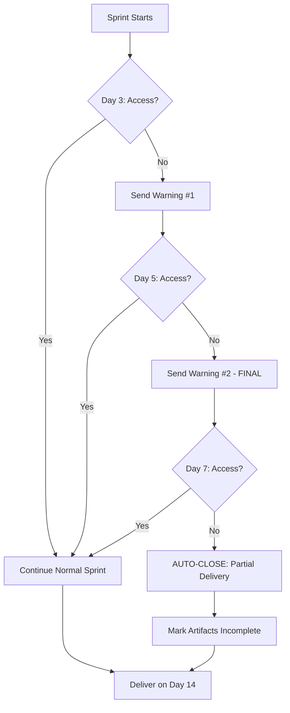

# Client Delay Kill Switch

Document: Collapse-Ready Sprint — Access Timeout & Auto-Close

Version: v01

---

## Purpose

Automatically close sprints when clients fail to provide required access.

**Rule:** Client delays do not extend sprint timelines unless explicitly agreed in writing.

---

## Time-Box Enforcement Logic

### Timeline

| Day | Event | Action |
| --- | --- | --- |
| Day 0 | Sprint start (workspace created) | Clock starts |
| Day 3 | Access check | If no access → Warning #1 |
| Day 5 | Access check | If no access → Warning #2 (final) |
| Day 7 | Access check | If no access → AUTO-CLOSE begins |
| Day 14 | Sprint deadline | Deliver whatever is possible |

---

## Make Scenario: CRS_04A_Access_Monitor

**Purpose:** Monitor client access provision and enforce time-box.

**Trigger:** Scheduled (daily check) or Notion status change

---

### MODULE 1 — Trigger: Daily Schedule

| Setting | Value |
| --- | --- |
| App | Make → Schedule |
| Interval | Daily at 09:00 UTC |

---

### MODULE 2 — Get Active Sprints

| Setting | Value |
| --- | --- |
| App | Notion |
| Action | Search objects |
| Database | CRS Clients |
| Filter | Sprint Status = "Active" AND Access Granted = false |

---

### MODULE 3 — Iterator

Process each sprint without access.

---

### MODULE 4 — Calculate Days Since Start

| Setting | Value |
| --- | --- |
| App | Make → Tools → Set variable |
| Variable | `days_since_start` |
| Value | `(now() - sprint_start_date) / (24 * 60 * 60 * 1000)` |

---

### MODULE 5 — Router: Action Decision

| Route | Condition | Action |
| --- | --- | --- |
| Route A | `days_since_start >= 3 AND days_since_start < 5` | Send Warning #1 |
| Route B | `days_since_start >= 5 AND days_since_start < 7` | Send Warning #2 (Final) |
| Route C | `days_since_start >= 7` | Initiate Auto-Close |

---

## ROUTE A — Warning #1 (Day 3)

### MODULE 6A — Check if Warning #1 Already Sent

| Setting | Value |
| --- | --- |
| App | Notion |
| Action | Get database item |
| Check | Warning_1_Sent = false |

If already sent → skip to end.

### MODULE 7A — Send Warning #1 Email

| Setting | Value |
| --- | --- |
| App | Gmail |
| Action | Send email |

**Subject:**

```
Collapse-Ready Sprint — Access Required (Action Needed)
```

**Body:**

```
Your sprint started {{days_since_start}} days ago.

We have not yet received the access or documentation needed to proceed.

ACTION REQUIRED

Please provide the following within 48 hours:
{{missing_access_items}}

WHAT HAPPENS IF ACCESS IS NOT PROVIDED

If we do not receive access by Day 7, the sprint will automatically 
transition to partial delivery mode.

This means:
• We will deliver findings based on available information only
• Scope limitations will be documented in all artifacts
• The full engagement fee remains due (sprint started, work performed)

Client delays do not extend sprint timelines.

If you need to discuss access challenges, reply to this email within 24 hours.

---
Collapse-Ready Sprint
Engagement Token: {{engagement_token}}
Days Remaining: {{14 - days_since_start}}
```

### MODULE 8A — Update Notion

| Setting | Value |
| --- | --- |
| App | Notion |
| Action | Update database item |
| Field | Warning_1_Sent |
| Value | true |
| Field | Warning_1_Date |
| Value | `{{now()}}` |

---

## ROUTE B — Warning #2 (Day 5) — FINAL WARNING

### MODULE 6B — Check if Warning #2 Already Sent

### MODULE 7B — Send Warning #2 Email

**Subject:**

```
⚠️ FINAL WARNING — Access Required Within 48 Hours
```

**Body:**

```
This is the final warning regarding access to your system.

CURRENT STATUS

Sprint started: {{sprint_start_date}}
Days elapsed: {{days_since_start}}
Access received: NO

DEADLINE

You have 48 hours to provide the required access.

CONSEQUENCE

If access is not provided by {{auto_close_date}}:

1. Sprint transitions to PARTIAL DELIVERY mode
2. We deliver findings based on information available at intake
3. Artifacts will be marked "INCOMPLETE - CLIENT DELAY"
4. Full engagement fee remains due
5. No refund available (sprint started, work performed)

This is a scope boundary, not a negotiation.

If there are legitimate access challenges, reply NOW.

---
Collapse-Ready Sprint
Engagement Token: {{engagement_token}}
Auto-Close Date: {{auto_close_date}}
```

### MODULE 8B — Update Notion

| Field | Value |
| --- | --- |
| Warning_2_Sent | true |
| Warning_2_Date | `{{now()}}` |
| Auto_Close_Date | `{{addHours(now; 48)}}` |

---

## ROUTE C — Auto-Close (Day 7+)

### MODULE 6C — Initiate Partial Delivery

**Sub-steps:**

1. **Update Sprint Status**
   - Status: `Partial Delivery - Client Delay`

2. **Generate Partial Delivery Scope Note**
   - Create document explaining limitations
   - List what could/couldn't be assessed
   - State reason: "Client failed to provide access"

3. **Mark All Artifacts as Incomplete**
   - Add watermark or header: "INCOMPLETE - CLIENT DELAY"
   - Document scope limitations in each artifact

4. **Proceed to Delivery Prep**
   - Continue to Scenario 5 with partial artifacts

### MODULE 7C — Send Auto-Close Notification

**Subject:**

```
Sprint Transitioned to Partial Delivery — Client Access Not Provided
```

**Body:**

```
Your Collapse-Ready Sprint has transitioned to partial delivery mode.

REASON

Required access was not provided within the specified timeline.

WHAT THIS MEANS

• Findings will be based on intake information only
• All artifacts will be marked "INCOMPLETE - CLIENT DELAY"
• Scope limitations will be documented throughout
• Delivery will occur on {{delivery_date}} as scheduled
• Full engagement fee remains due

This is not a judgment — it is the enforcement of clearly stated terms.

The sprint terms stated: "Client delays do not extend sprint timelines."

If you believe this is an error, reply within 24 hours with documentation 
of access provided.

---
Collapse-Ready Sprint
Engagement Token: {{engagement_token}}
Status: Partial Delivery - Client Delay
```

### MODULE 8C — Update Notion

| Field | Value |
| --- | --- |
| Sprint Status | `Partial Delivery - Client Delay` |
| Auto_Closed | true |
| Auto_Close_Date | `{{now()}}` |
| Partial_Delivery_Reason | "Access not provided" |

---

## Partial Delivery Protocol

### Document Modifications

Add to each artifact header:

```
⚠️ SCOPE LIMITATION NOTICE

This document was prepared with LIMITED information due to client delay 
in providing required access.

Access Requested: {{access_requested}}
Access Received: NONE
Days Elapsed Before Auto-Close: {{days_elapsed}}

Findings are based solely on information provided during intake.
Additional risks may exist that could not be assessed.
```

### Executive Summary Addition

Add section:

```
## Engagement Limitation

This assessment was completed under partial delivery protocol.

REASON: Client did not provide required system access within 7 days of 
sprint start.

IMPACT: Findings are limited to information available at intake. 
The following could not be assessed:
• [List of inaccessible systems/components]

RECOMMENDATION: Consider a follow-up engagement once access can be 
provided.
```

---

## Notion Schema Addition

Add to CRS Clients database:

| Field | Type |
| --- | --- |
| Access Granted | Checkbox |
| Access Granted Date | Date |
| Warning_1_Sent | Checkbox |
| Warning_1_Date | Date |
| Warning_2_Sent | Checkbox |
| Warning_2_Date | Date |
| Auto_Closed | Checkbox |
| Auto_Close_Date | Date |
| Partial_Delivery_Reason | Text |

---

## Flowchart



---

## Exception Handling

### Legitimate Access Delays

If client provides valid reason (e.g., IT approval process):

1. Document the delay reason in Notion
2. **Operator decision required** — system does NOT auto-extend
3. If extension granted: manually update Auto_Close_Date
4. Extension must be documented in writing

### Partial Access Provided

If client provides some but not all access:

1. Proceed with available access
2. Document scope limitations for inaccessible items
3. Do NOT trigger auto-close if partial access is usable
4. Mark specific findings as "Limited by access"

---

## Why This Matters

- **Prevents indefinite delays:** Client cannot slow-walk the engagement
- **Protects your time:** Work proceeds regardless of client responsiveness
- **Clear expectations:** Terms stated upfront, enforced consistently
- **Professional boundary:** System enforces, not you personally
- **Eliminates "we slowed you down" reversals:** Timeline is fixed, documented
