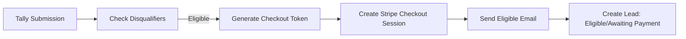
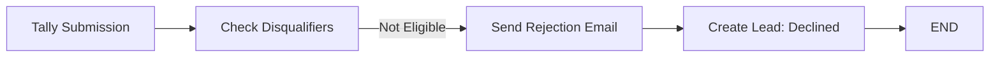
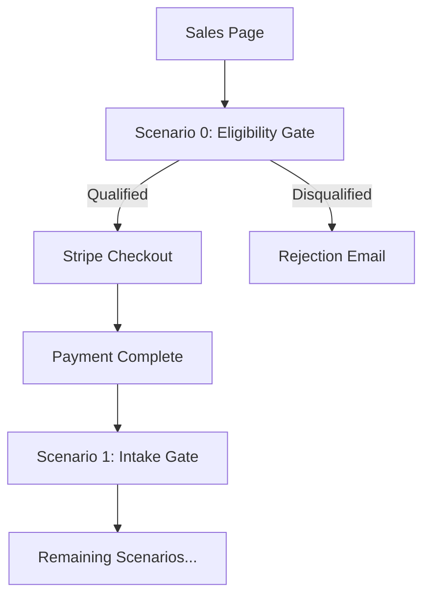

# Eligibility Gate Specification

Document: Collapse-Ready Sprint — Pre-Purchase Eligibility Gate

Version: v01

---

## Purpose

Filter unqualified prospects **before** payment to:

- Reduce refunds
- Reduce emotional labor
- Increase perceived seriousness
- Filter "credential-seekers" and vibe buyers

This is the single highest-ROI control surface.

---

## Form Overview

| Attribute | Value |
| --- | --- |
| Platform | Tally.so |
| Purpose | Pre-purchase qualification |
| Outcome | Stripe checkout link OR polite rejection |
| No payment at this stage | True |

---

## Form Flow

```
Prospect lands on sales page
       ↓
"Check Eligibility" button
       ↓
Eligibility Gate form (Tally)
       ↓
Make.com validates responses (Scenario 0)
       ↓
    ├─→ Eligible → Generate Stripe checkout link → Email
    └─→ Not Eligible → Polite rejection email + resources
```

---

## Form Copy (Production-Ready)

**Title:** Collapse-Ready Sprint — Eligibility Check

**Subheading:** This engagement is artifact-based, async-only, and fixed-scope. Please confirm fit before proceeding.

---

## Form Sections

### Section A — System Reality

**1. What are you asking to be reviewed?**

| Option | Eligible |
| --- | --- |
| ☐ Software handling sensitive data | ✅ |
| ☐ Evidence / documentation system under dispute or audit | ✅ |
| ☐ Other (describe) | ✅ |

**2. Do you control access to the system?**

| Option | Eligible |
| --- | --- |
| ☐ Yes (repo / configs / docs) | ✅ |
| ☐ Partial | ✅ |
| ☐ No | ❌ AUTO-DISQUALIFY |

**3. Primary risk you're trying to reduce (select up to 2):**

| Option | Eligible |
| --- | --- |
| ☐ Privacy / data exposure | ✅ |
| ☐ Legal or regulatory scrutiny | ✅ |
| ☐ Procedural failure (lost evidence, ambiguity) | ✅ |
| ☐ Release risk / regressions | ✅ |

---

### Section B — Engagement Constraints (Hard)

**4. Communication model**

| Option | Eligible |
| --- | --- |
| ☐ Async-only by default | ✅ REQUIRED |
| ☐ Written deliverables only | ✅ REQUIRED |
| Any other selection | ❌ AUTO-DISQUALIFY |

**5. Scope model**

| Option | Eligible |
| --- | --- |
| ☐ Fixed scope, no creep | ✅ REQUIRED |
| ☐ I accept that assumptions and out-of-scope items will be documented, not negotiated | ✅ REQUIRED |

**6. Evaluation standard**

| Option | Eligible |
| --- | --- |
| ☐ I will evaluate outputs by inspection/testing, not credentials | ✅ REQUIRED |
| ☐ I understand this is not a compliance certification | ✅ REQUIRED |

---

### Section C — Authority & Intent

**7. What would make this a failure for you?** (short answer; required)

_Free text field — captures client expectations for review_

**8. Do you require credentials, titles, or certifications as a condition of acceptance?**

| Option | Eligible |
| --- | --- |
| ☐ No | ✅ |
| ☐ Yes | ❌ AUTO-DISQUALIFY |

---

### Final Acknowledgement (Required)

**9. I acknowledge:**

- Async-only engagement
- Fixed scope
- Artifact-based evaluation
- Conditional refunds (pre-sprint only)
- No authority claims or certifications

| Option | Eligible |
| --- | --- |
| ☐ I agree | ✅ REQUIRED |
| Unchecked | ❌ AUTO-DISQUALIFY |

---

## Eligibility Logic (Make Router)

**Eligible IF ALL TRUE:**

| Condition | Check |
| --- | --- |
| Access control | ≠ "No" |
| Communication model | = "Async-only by default" AND "Written deliverables only" |
| Scope acknowledged | Both scope checkboxes checked |
| Evaluation standard | Both evaluation checkboxes checked |
| Credentials requirement | = "No" |
| Final acknowledgement | Checked |

**Else: REJECT**

### Automatic Disqualification (Hard No)

Reject immediately if ANY of these:

| Condition | Field | Value |
| --- | --- | --- |
| No system access control | Q2 | "No" |
| Requires synchronous communication | Q4 | Missing either checkbox |
| Requires credentials | Q8 | "Yes" |
| Final acknowledgement missing | Q9 | Unchecked |

### Warning Flags (Proceed with Caution)

Flag but allow if:

| Condition | Action |
| --- | --- |
| Partial system access | Note in lead record |
| "Other" system type | Review description before checkout |

---

## Automation (Make Scenario: Eligibility_Gate)

**Trigger:** Tally → Form Submitted

### Path A — Eligible



**Steps:**

1. **Make: Generate unique Checkout Token**
2. **Stripe: Create Checkout Session**
   - Product: Collapse-Ready Systems Hardening™
   - Add optional "Single Call" upsell
3. **Gmail: Send "Eligible — Proceed to Checkout"**
   - Includes Stripe link
   - Reiterates constraints
4. **Notion: Create Lead Record**
   - Status = `Eligible / Awaiting Payment`

### Path B — Rejected



**Steps:**

1. **Gmail: Send "Not a Fit — Engagement Declined"**
2. **Notion: Create Lead Record**
   - Status = `Declined (Eligibility)`
   - Reason = [specific disqualification]
3. **END**

---

## Email Templates

### Eligible Email

**Subject:** Collapse-Ready Sprint — Eligible — Proceed to Checkout

**Body:**

```
Thank you for completing the eligibility check.

Based on your responses, the Collapse-Ready Sprint is a good fit for your needs.

NEXT STEP

Complete your purchase to begin:

{{stripe_checkout_link}}

WHAT HAPPENS AFTER PURCHASE

1. You receive an intake form (48h to complete)
2. We validate your submission
3. Your sprint workspace is created
4. Work begins, delivery in 14 days

REMINDERS

• Async-only communication
• Fixed scope, no changes mid-sprint
• 14-day fixed timeline
• Written deliverables only
• Artifact-based evaluation (not credentials)

If you have questions before purchasing, reply to this email.

---
Collapse-Ready Sprint
```

### Rejection Email (Not a Fit)

**Subject:** Engagement Not a Fit — Next Steps

**Body:**

```
Thanks for completing the eligibility check.

Based on your responses, this engagement isn't a fit.

The Collapse-Ready Sprint is:
• Async-only
• Fixed-scope
• Evaluated by inspectable artifacts, not credentials

If you need authority signaling, ongoing support, or certification, you'll be better served by a traditional firm.

This decision isn't a judgment — it's a scope boundary.

Wishing you a clean outcome.
```

**Note:** No apology. No debate hook. No alternative resources offered.

### Disqualification Reason Mapping

| Disqualifier | Internal Code |
| --- | --- |
| No system access control | `NO_ACCESS` |
| Requires synchronous communication | `NEEDS_CALLS` |
| Requires credentials for acceptance | `NEEDS_CREDENTIALS` |
| Final acknowledgement not checked | `NO_ACKNOWLEDGEMENT` |

---

## Notion Schema Addition

### Leads Table

| Field | Type | Values |
| --- | --- | --- |
| Email | Email | |
| Organization | Text | |
| Status | Select | Pending, Qualified, Disqualified, Converted |
| Disqualification Reason | Text | (if applicable) |
| Submitted At | Date | |
| Stripe Link Sent | Checkbox | |
| Converted At | Date | (if purchased) |

---

## Integration with Existing Flow

The eligibility gate becomes **Scenario 0** in the automation sequence:

```
Scenario 0: Eligibility Gate (NEW)
       ↓
Scenario 1: Payment → Intake Gate
       ↓
Scenario 2: Intake Submission → Validation
       ...
```

**Updated flow:**



---

## Metrics to Track

| Metric | Purpose |
| --- | --- |
| Eligibility form submissions | Volume |
| Qualification rate | % who pass |
| Disqualification reasons | Identify patterns |
| Conversion rate (qualified → purchased) | Effectiveness |
| Refund rate (post-implementation) | Success measure |

---

## Why This Works

- **Reduces refunds:** Bad fits filtered before money moves
- **Reduces emotional labor:** System handles rejection, not you
- **Increases seriousness:** Barrier signals commitment
- **Filters vibe buyers:** Specific questions expose misalignment
- **Protects reputation:** No failed engagements to explain

This is the bouncer before the door.
