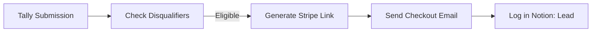
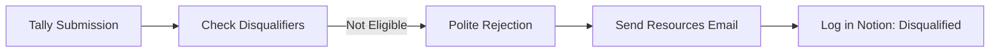
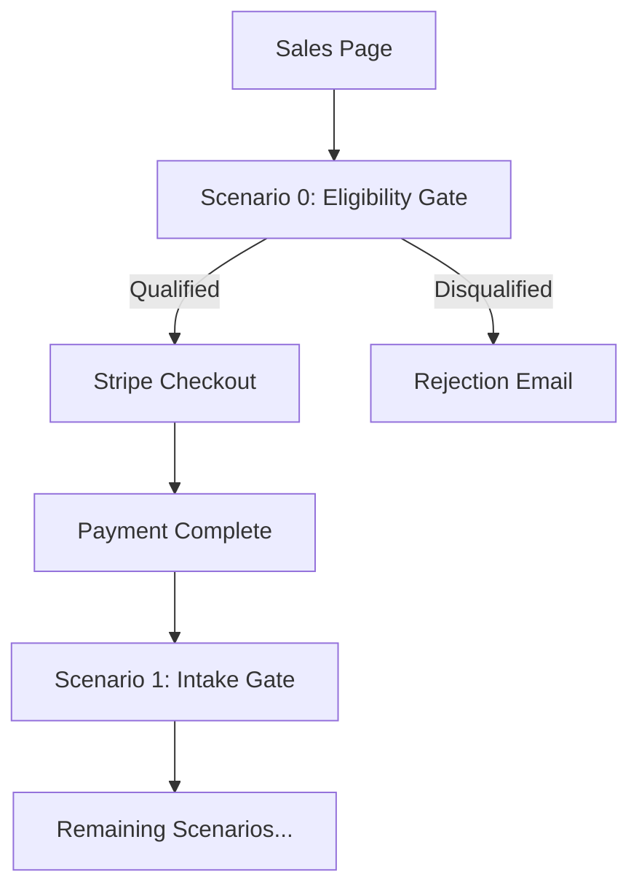

# Eligibility Gate Specification

Document: Collapse-Ready Sprint — Pre-Purchase Eligibility Gate

Version: v01

---

## Purpose

Filter unqualified prospects **before** payment to:

- Reduce refunds
- Reduce emotional labor
- Increase perceived seriousness
- Filter "credential-seekers" and vibe buyers

This is the single highest-ROI control surface.

---

## Form Overview

| Attribute | Value |
| --- | --- |
| Platform | Tally.so |
| Purpose | Pre-purchase qualification |
| Outcome | Stripe checkout link OR polite rejection |
| No payment at this stage | True |

---

## Form Flow

```
Prospect lands on sales page
       ↓
"Check Eligibility" button
       ↓
Eligibility Gate form (Tally)
       ↓
Automation validates responses
       ↓
    ├─→ Eligible → Generate Stripe checkout link → Email
    └─→ Not Eligible → Polite rejection email + resources
```

---

## Form Sections

### Section 1: Contact Information

| Field | Type | Required |
| --- | --- | --- |
| Email | Email | Yes |
| Organization Name | Text | No |
| Role/Title | Text | No |

---

### Section 2: System Readiness

| Field | Type | Required | Disqualifies If |
| --- | --- | --- | --- |
| Do you have a system ready for assessment? | Radio | Yes | "No, we're still building" |
| Can you provide read-only access or documentation? | Radio | Yes | "No" or "We need to discuss" |
| Is this a production or production-equivalent system? | Radio | Yes | "No, it's a prototype" |

**Options for "System Ready":**
- Yes, it's in production
- Yes, it's in staging/pre-production
- No, we're still building ❌
- Not sure (describe below)

**Options for "Access":**
- Yes, we can provide access
- Yes, we can provide documentation
- No ❌
- We need to discuss first ❌

**Options for "Production-equivalent":**
- Yes, production
- Yes, staging/pre-production
- No, it's a prototype ❌
- Not sure

---

### Section 3: Engagement Fit

| Field | Type | Required | Disqualifies If |
| --- | --- | --- | --- |
| What is your primary goal? | Checkboxes | Yes | See below |
| Communication preference | Radio | Yes | "We need calls" |
| Timeline expectations | Radio | Yes | "We need it faster" |
| Do you need compliance certification? | Radio | Yes | "Yes, we need certification" |

**Primary Goal Options (select all that apply):**
- [ ] Identify security vulnerabilities ✅
- [ ] Understand data flows and risks ✅
- [ ] Get hardening recommendations ✅
- [ ] Validate compliance ❌ (disqualifies if ONLY this)
- [ ] Get a security stamp/credential ❌ (disqualifies if ONLY this)
- [ ] Due diligence for acquisition ✅
- [ ] Pre-audit preparation ✅

**Communication Preference:**
- Async-only is fine (email) ✅
- We prefer async but may need one call ✅
- We need regular calls ❌
- We need ongoing support ❌

**Timeline Expectations:**
- 14 days works for us ✅
- 14 days is tight but acceptable ✅
- We need it faster ❌
- We're flexible ✅

**Compliance Certification:**
- No, we understand this is not certification ✅
- We'd like artifacts to support compliance ✅
- Yes, we need certification ❌

---

### Section 4: Access Confirmation

| Field | Type | Required | Disqualifies If |
| --- | --- | --- | --- |
| Repository access | Radio | Yes | "We cannot provide any" |
| Third-party service documentation | Radio | Yes | N/A |
| Responsiveness commitment | Radio | Yes | "We may be slow" |

**Repository Access:**
- GitHub/GitLab read-only access ✅
- Documentation export ✅
- We'll need to arrange separately ✅
- We cannot provide any ❌

**Third-party Services:**
- Yes, we can document them ✅
- Partially ✅
- No ⚠️ (warning, not disqualifying)

**Responsiveness Commitment:**
- We can respond within 24h during sprint ✅
- We may need 48h ✅
- We may be slow (3+ days) ❌

---

### Section 5: Acknowledgments

| Field | Type | Required | Disqualifies If |
| --- | --- | --- | --- |
| Async communication | Checkbox | Yes | Unchecked |
| Fixed scope | Checkbox | Yes | Unchecked |
| 14-day timeline | Checkbox | Yes | Unchecked |
| Written deliverables only | Checkbox | Yes | Unchecked |

**Checkbox Text:**

- [ ] I understand this engagement is async-only (no calls unless purchased separately)
- [ ] I understand scope is fixed and changes require a new engagement
- [ ] I understand the 14-day timeline is fixed
- [ ] I understand deliverables are written documents, not certifications

---

## Disqualification Logic

### Automatic Disqualification (Hard No)

Reject if ANY of these:

| Condition | Reason |
| --- | --- |
| System not ready | "No, we're still building" |
| Cannot provide access | "No" or "We need to discuss" |
| Prototype only | "No, it's a prototype" |
| Goal is only certification | Only "Validate compliance" selected |
| Goal is only credential | Only "Get a security stamp" selected |
| Needs regular calls | "We need regular calls" |
| Needs ongoing support | "We need ongoing support" |
| Needs it faster | "We need it faster" |
| Needs certification | "Yes, we need certification" |
| Cannot provide any repo access | "We cannot provide any" |
| Slow responsiveness | "We may be slow (3+ days)" |
| Any acknowledgment unchecked | Missing required understanding |

### Warning (Proceed with Caution)

Flag but allow if:

| Condition | Warning |
| --- | --- |
| Third-party services partial | "Partially documented" |
| Not sure about system status | "Not sure" responses |
| May need one call | "We prefer async but may need one call" |

---

## Automation (Make Scenario 0)

### Eligible Flow



**Steps:**

1. **Tally → Make webhook**
2. **Validate responses against disqualification rules**
3. **If eligible:**
   - Generate unique Stripe checkout session
   - Send "You're Eligible — Complete Purchase" email
   - Create Notion lead record (Status: Qualified)

### Not Eligible Flow



**Steps:**

1. **Tally → Make webhook**
2. **Validate responses against disqualification rules**
3. **If not eligible:**
   - Send "Not a Fit Right Now" email with resources
   - Create Notion lead record (Status: Disqualified, Reason: [specific])

---

## Email Templates

### Eligible Email

**Subject:** Collapse-Ready Sprint — You're Eligible

**Body:**

```
Thank you for completing the eligibility check.

Based on your responses, the Collapse-Ready Sprint is a good fit for your needs.

NEXT STEP

Complete your purchase to begin:

{{stripe_checkout_link}}

WHAT HAPPENS AFTER PURCHASE

1. You receive an intake form (48h to complete)
2. We validate your submission
3. Your sprint workspace is created
4. Work begins, delivery in 14 days

REMINDERS

• Async-only communication
• Fixed scope, no changes mid-sprint
• 14-day fixed timeline
• Written deliverables only

If you have questions before purchasing, reply to this email.

---
Collapse-Ready Sprint
```

### Not Eligible Email

**Subject:** Collapse-Ready Sprint — Not a Fit Right Now

**Body:**

```
Thank you for your interest in the Collapse-Ready Sprint.

Based on your responses, this engagement isn't the right fit at this time.

REASON

{{disqualification_reason}}

WHAT YOU CAN DO INSTEAD

{{alternative_resources}}

If your situation changes, you're welcome to check eligibility again.

---
Collapse-Ready Sprint
```

### Disqualification Reasons + Alternatives

| Reason | Message | Alternative |
| --- | --- | --- |
| System not ready | "Your system is still in development" | "Consider engaging once you have a production or staging environment" |
| Cannot provide access | "You indicated you cannot provide system access or documentation" | "We require some form of access to perform the assessment" |
| Needs calls | "You indicated a need for regular calls" | "This engagement is async-only; consider a consulting engagement instead" |
| Needs certification | "You're looking for compliance certification" | "This engagement produces artifacts for evaluation, not certification" |
| Timeline mismatch | "You need results faster than 14 days" | "Consider a shorter-scope engagement or expedited service" |
| Slow responsiveness | "You indicated slow response times (3+ days)" | "This engagement requires timely responses to avoid delays" |

---

## Notion Schema Addition

### Leads Table

| Field | Type | Values |
| --- | --- | --- |
| Email | Email | |
| Organization | Text | |
| Status | Select | Pending, Qualified, Disqualified, Converted |
| Disqualification Reason | Text | (if applicable) |
| Submitted At | Date | |
| Stripe Link Sent | Checkbox | |
| Converted At | Date | (if purchased) |

---

## Integration with Existing Flow

The eligibility gate becomes **Scenario 0** in the automation sequence:

```
Scenario 0: Eligibility Gate (NEW)
       ↓
Scenario 1: Payment → Intake Gate
       ↓
Scenario 2: Intake Submission → Validation
       ...
```

**Updated flow:**



---

## Metrics to Track

| Metric | Purpose |
| --- | --- |
| Eligibility form submissions | Volume |
| Qualification rate | % who pass |
| Disqualification reasons | Identify patterns |
| Conversion rate (qualified → purchased) | Effectiveness |
| Refund rate (post-implementation) | Success measure |

---

## Why This Works

- **Reduces refunds:** Bad fits filtered before money moves
- **Reduces emotional labor:** System handles rejection, not you
- **Increases seriousness:** Barrier signals commitment
- **Filters vibe buyers:** Specific questions expose misalignment
- **Protects reputation:** No failed engagements to explain

This is the bouncer before the door.
